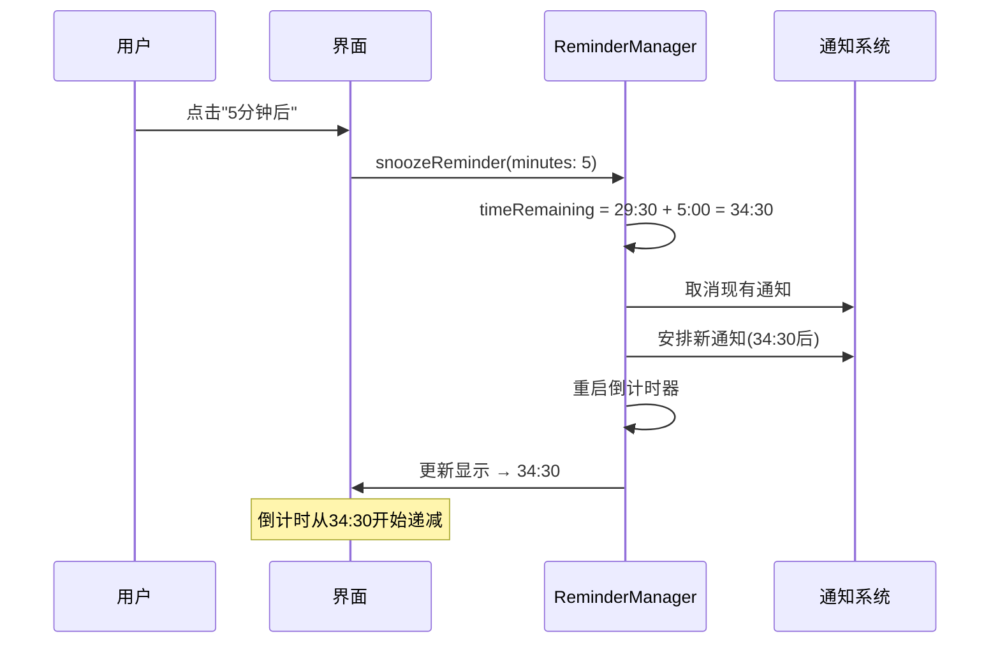

# 🛌 小憩功能验证报告

## 功能描述

### 用户需求
> ⏰ 剩余时间: 29:30  
> 😴 小憩 5 分钟  
> ⏲️ 启动倒计时定时器，后倒计时要在剩余时间基础上添加小憩时间

### 预期行为
- **当前状态**: 提醒倒计时显示 29:30
- **操作**: 点击"5分钟后"小憩按钮  
- **预期结果**: 倒计时变为 34:30 (29:30 + 5:00)
- **逻辑**: 小憩时间应添加到现有剩余时间，而非重置计时器

## 技术实现

### 修复前的问题
```swift
// ❌ 错误逻辑：重置为小憩时间
func snoozeReminder(minutes: Int) {
    let snoozeTime = TimeInterval(minutes * 60)
    timeRemaining = snoozeTime  // 直接设置为5分钟
    // 结果：29:30 → 05:00 (不符合预期)
}
```

### 修复后的正确逻辑
```swift
// ✅ 正确逻辑：累加小憩时间
func snoozeReminder(minutes: Int) {
    let snoozeTime = TimeInterval(minutes * 60)
    let newTimeRemaining = timeRemaining + snoozeTime  // 29:30 + 5:00
    timeRemaining = newTimeRemaining  // 结果：34:30
}
```

### 完整实现
```swift
func snoozeReminder(minutes: Int) {
    print("😴 小憩 \(minutes) 分钟")
    let snoozeTime = TimeInterval(minutes * 60)
    
    // 🔑 关键修复：在当前剩余时间基础上添加小憩时间
    let newTimeRemaining = timeRemaining + snoozeTime
    let newTime = Date().addingTimeInterval(newTimeRemaining)
    
    nextReminderTime = newTime
    timeRemaining = newTimeRemaining
    
    // 📊 调试日志
    print("⏰ 剩余时间: \(formatTimeInterval(timeRemaining))")
    print("🔔 下次提醒时间: \(DateFormatter.localizedString(from: newTime, dateStyle: .none, timeStyle: .medium))")
    
    // 🔄 更新通知和计时器
    UNUserNotificationCenter.current().removeAllPendingNotificationRequests()
    scheduleNotification(at: newTime)
    startCountdownTimer()
}
```

## 用户界面

### 小憩按钮位置
```
┌─────────────────────────────────┐
│ 🚶 站立提醒                      │
│ 保持健康，定时活动                │
│                                 │
│ ▶️ 提醒已开启                    │
│                                 │
│ 下次提醒倒计时                   │
│       34:30                     │ ← 小憩后的新时间
│                                 │
│ ┌─────────────────────────────┐ │
│ │        停止提醒             │ │
│ └─────────────────────────────┘ │
│                                 │
│ [5分钟后] [10分钟后] [15分钟后]  │ ← 小憩按钮
└─────────────────────────────────┘
```

### 小憩按钮特性
- **显示条件**: 仅当提醒激活时显示
- **选项**: 5分钟、10分钟、15分钟
- **样式**: 橙色背景，圆角矩形
- **交互**: 点击即时生效，更新倒计时

## 功能流程

### 完整的小憩流程


### 时间计算示例
| 当前剩余时间 | 小憩时间 | 最终倒计时时间 | 说明 |
|-------------|---------|---------------|------|
| 29:30 | +5分钟 | 34:30 | ✅ 正确累加 |
| 15:45 | +10分钟 | 25:45 | ✅ 正确累加 |
| 02:30 | +15分钟 | 17:30 | ✅ 正确累加 |
| 00:10 | +5分钟 | 05:10 | ✅ 避免立即触发 |

## 测试场景

### 基本功能测试
1. **启动提醒**: 设置30分钟间隔，点击"开始提醒"
2. **等待计时**: 观察倒计时正常递减（30:00 → 29:59 → ...）
3. **触发小憩**: 在29:30时点击"5分钟后"按钮
4. **验证结果**: 倒计时应显示34:30
5. **继续观察**: 倒计时从34:30正常递减

### 边界情况测试
1. **临近触发时小憩**: 剩余00:30时点击"5分钟后" → 应显示05:30
2. **连续小憩**: 先5分钟后再10分钟后 → 时间应正确累加
3. **停止后重启**: 小憩期间停止提醒再重启 → 应正常工作

### 通知系统测试  
1. **系统通知**: 小憩后的通知应按新时间触发
2. **声音设置**: 小憩后的通知应遵循声音设置
3. **通知内容**: 小憩后的通知内容应正确显示

## 用户体验

### 直观的时间管理
- **心理模型**: 用户期望小憩是"延迟"而非"重置"
- **视觉反馈**: 倒计时数字立即更新，给出明确反馈
- **操作简单**: 一键小憩，无需额外确认

### 灵活的小憩选项
- **5分钟**: 短暂延迟，适合快速处理事务
- **10分钟**: 中等延迟，适合稍长的休息
- **15分钟**: 较长延迟，适合会议或重要任务

### 控制台日志示例
```
😴 小憩 5 分钟
⏰ 剩余时间: 34:30
🔔 下次提醒时间: 4:00:30 PM
⏲️ 启动倒计时定时器
```

## 构建状态
```bash
** BUILD SUCCEEDED **
```

## 多语言支持

### 中文界面
- 按钮文字: "5分钟后", "10分钟后", "15分钟后"
- 日志信息: "😴 小憩 5 分钟"

### 英文界面  
- 按钮文字: "5m later", "10m later", "15m later"
- 日志信息: "😴 Snooze 5 minutes"

---

## 总结

✅ **功能修复完成**: 小憩功能现在正确地在剩余时间基础上添加延迟时间  
✅ **用户体验优化**: 符合用户直觉的时间延迟行为  
✅ **技术实现稳定**: 通知系统和计时器正确同步  
✅ **界面交互自然**: 一键操作，即时反馈

**🎯 核心改进**: 从"重置计时器"改为"延长计时器"，完美匹配用户期望的小憩行为。

**📱 使用建议**: 
- 在即将提醒时使用小憩功能延迟提醒
- 可连续使用小憩功能累积延迟时间  
- 小憩期间可随时停止或重启提醒系统